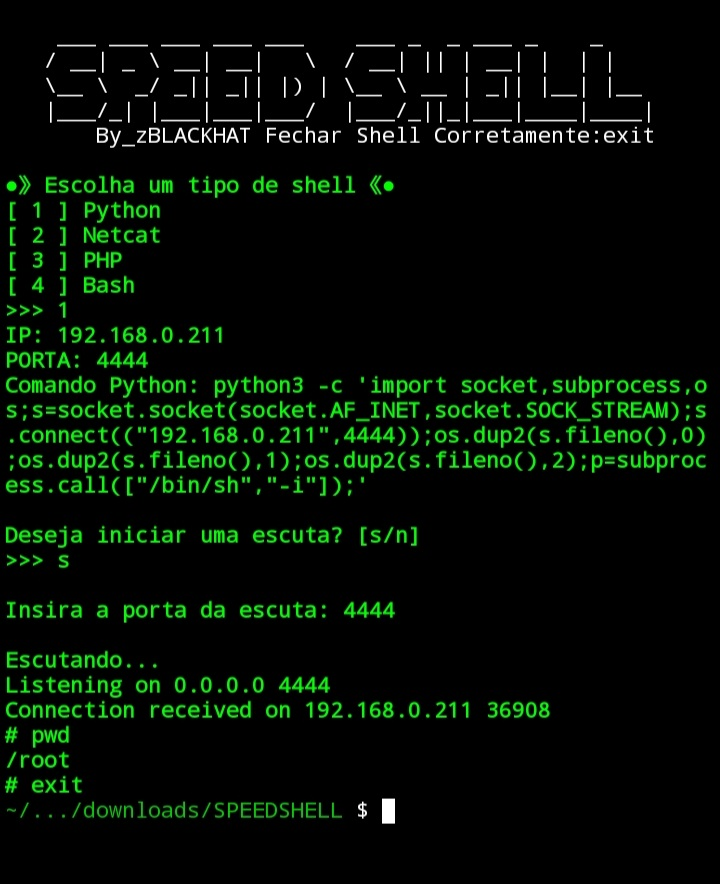

# Speed Shell

## Descrição
Speed Shell é uma ferramenta poderosa e rápida para criar shells reversos em diversos ambientes de rede, como Python, Netcat, PHP e Bash. Ideal para testes e desenvolvimento, Speed Shell permite configurar conexões de forma eficiente e prática.

## Uso
1. Escolha um tipo de shell:
   - [1] Python
   - [2] Netcat
   - [3] PHP
   - [4] Bash

2. Insira o IP e a porta para configurar o shell desejado.
3. Inicie uma escuta para conexões entrantes.

## Instalação
Clone o repositório e execute o script Python:

```bash
git clone https://github.com/Hacker666EXE/SPEEDSHELL
cd speed-shell
python SPEEDSHELL.py
```
